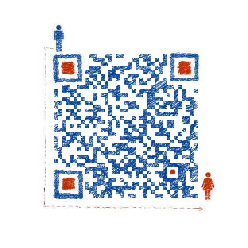

# nuxt-juejin-learn

reference link:
- [解决nuxtjs本地开发跨域和防止路由与api冲突问题](https://segmentfault.com/a/1190000010815403)
- [nuxtjs/axios文档](https://axios.nuxtjs.org/usage.html)
- [nuxtjs官网/plugins](https://zh.nuxtjs.org/api/configuration-plugins)
- [nuxt练习掘金网站](https://github.com/xuqiang521/nuxt-ssr-demo)

针对服务端渲染，先建立一个整体的认识，其本质就是用服务端把vue写的页面渲染成HTML字符串直接传递到浏览器中，在这个过程中要关注路由的触发流程改变，部分使用浏览器API的代码的改写，以及最重要的框架渲染状态在浏览器端的合并等等，幸运的是Nuxt的出现让我们很容易来完成这些工作。

鉴于我的Node技术栈是koa2，所以比较关注koa2如何调用Nuxt的方法来完成服务端渲染，其实Nuxt本身并不强依赖任何的后端框架，如果只是改造原有项目，也可以直接用我参考的[nuxt练习掘金网站](https://github.com/xuqiang521/nuxt-ssr-demo)来学习。

## koa-nuxt-juejin

> 项目来源：[xudada](https://github.com/xuqiang521/nuxt-ssr-demo) 在其基础上改进的demo

项目的效果可参见 http://118.25.109.133:82/

本仓库使用方法：

```bash
# install dependencies
$ npm install

# serve with hot reload at localhost:3001
$ npm run dev

# build for production and launch server
$ npm run build
$ npm start

# generate static project
$ npm run generate
```

项目搭建过程

1. 如果没有全局安装`vue-cli`则先执行安装命令`npm install -g vue-cli`
2. 初始化项目 `vue init nuxt/koa nuxt-juejin-learn`
3. 安装依赖包并启动开发模式 `npm install && npm run dev`
4. 将来源仓库的代码放入对应的文件夹中，并进行部分优化改造

与来源仓库的不同之处：

- Node服务端使用了`koa2`框架，便于后续进一步丰富服务端功能
- 用最佳实践来使用`nuxtjs/axios`这个插件，减少了部分冗余配置代码
- 在组件的`asyncData`逻辑中获取数据不再使用`dispatch`来获取
- 所有的数据获取具体逻辑放在`data`文件夹下统一管理

重点说一下 `nuxtjs/axios` 这个库的使用方法，因为我在网上查到的教程大多都不正确，为了让大家更好地使用这个库的功能，总结了以下几个关键点：

1. 这个库会在各个上下文对象上挂载`$axios`这个方法，所以不要再次引入`axios`库，从而配置都在一处。
2. 在`action`中方法是挂载在`store`上，`asyncData`中是挂载在`app`这个对象上(`app.$axios`)，并且作为一个插件注入了所有Vue的实例中(`this.$axios`)，可以说任何需要异步获取数据的地方都有这个$axios变量方法可用。
3. 在`nuxt.config.js`这个文件中，可以通过配置`axios`的`BaseURL`和`BrowserURL`来分别指定不同的前缀，此项目未配置`BrowserURL`，是默认和`BaseURL`保持一致。
4. 在`nuxt.config.js`这个文件中可以通过配置proxy这个对象来指定数据源的targetUrl，从而避免跨域。
5. 在本项目里使用的是`Fetch`类的数据获取方式，通过`$axios.$get`这个方法来直接获取到`res.data`。

如果本项目能帮到你，请不要吝啬你的star哦。当然，我也在源仓库作者建立的QQ交流群里，如果想进一步学习和使用nuxt来做项目的服务端渲染改造的话，可以另外扫码加入微信群，一起探讨和交流哈。


如果上面的微信群加入二维码失效，也可以加我个人微信，我拉你入群，一起探讨：

